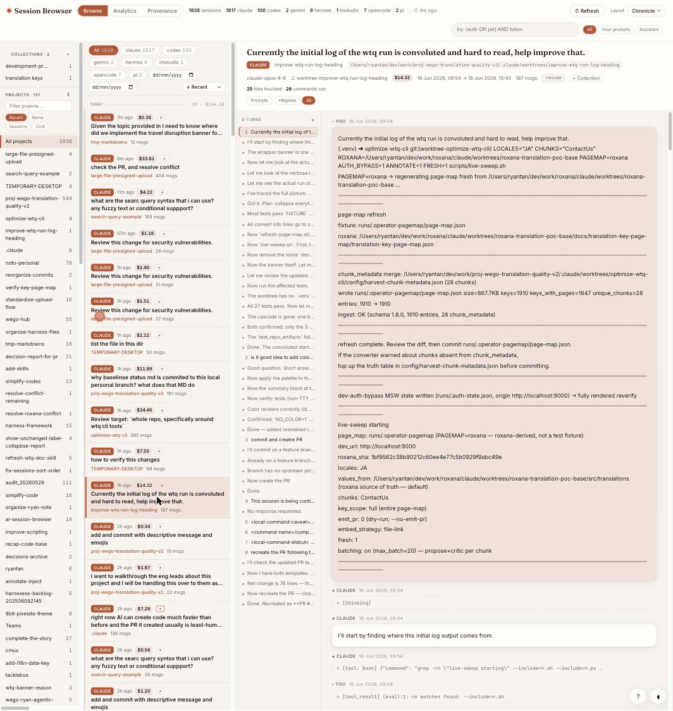

# session-browser

Local web UI to **browse, search, cost-analyse, and trace** your AI coding session history — across **Claude Code**, **Codex CLI**, **Gemini CLI**, **Pi**, **Hermes**, **OpenCode**, and **LM Studio** — in one place.

Zero third-party dependencies: Python 3 stdlib only (`sqlite3` + `http.server`). Works fully offline.



## Quick start

```bash
git clone https://github.com/ryantss/ai-session-browser
cd ai-session-browser
python3 server.py
```

Opens `http://localhost:8765/` automatically. Python 3.9+ is all you need — no install, no dependencies.

### As a Claude Code plugin

```bash
claude plugin marketplace add /path/to/ai-session-browser   # or the GitHub URL
claude plugin install session-browser
```

This adds a `/browse-sessions` command to Claude Code.

### Optional: install as a CLI

```bash
pipx install .        # then run:  ai-session-browser
```

---

## Three views

### Browse
Project sidebar · full-text search · rendered Markdown transcripts · collapsible tool blocks · per-session cost badges · keyboard nav (`j`/`k`/`/`) · date filters · **Collections** (bookmark sessions into named groups via the `+` button, filter the list by collection).

### Analytics
Token and cost dashboard — $ per day, per model, per project, per tool — plus cache savings and a **day × hour activity heatmap**. Built entirely from log data already on disk.

### Provenance
Answer "which sessions touched `ingester.py`?" or "every `git push` I ran?" with direct `claude --resume` / `codex resume` links and `cursor://` / `vscode://` jump-to-file. Also surfaces a flat feed of your Codex prompt history.

---

## What it indexes

| Tool | Location |
|---|---|
| Claude Code | `~/.claude/projects/<encoded-cwd>/<uuid>.jsonl` |
| Codex CLI | `~/.codex/sessions/YYYY/MM/DD/rollout-*.jsonl` |
| Gemini CLI | `~/.gemini/tmp/<name\|hash>/chats/session-*.{json,jsonl}` |
| Pi | `~/.pi/agent/sessions/<encoded-cwd>/*.jsonl` |
| Hermes | `~/.hermes/sessions/*.jsonl` |
| OpenCode | `~/.local/share/opencode/opencode.db` |
| LM Studio | `~/.lmstudio/conversations/*.conversation.json` |
| Paperclip-wrapped Codex | `~/.paperclip/instances/*/codex-home/sessions/**/rollout-*.jsonl` |

Re-running only re-parses files whose `mtime` changed, so day-to-day startups are sub-second even with thousands of sessions.

---

## Flags & env

| Flag / env | Effect |
|---|---|
| `--port N` / `SESSION_BROWSER_PORT` | Serve on a different port (default `8765`). |
| `--reindex` | Force a full rebuild (use if a tool changes its on-disk format). |
| `--no-open` | Don't auto-open the browser. |
| `SESSION_BROWSER_DB` | Override the index DB path. |

## Search syntax

Bare words are treated as a prefix-AND search (`refund bigquery` → sessions containing both). FTS5 operators pass through: `"exact phrase"`, `term*`, `a OR b`, `NEAR(a b, 5)`.

## HTTP API

`GET /api/stats` · `GET /api/sessions` (filters: `tool`, `project`, `model`, `branch`, `from`, `to`, `collection`) · `GET /api/session?id=` (returns transcript + `tool_events` + `usage`) · `GET /api/search?q=` · `GET /api/projects` · `GET /api/analytics` · `GET /api/provenance?q=&kind=file|command` · `GET /api/history?q=` · `GET /api/reindex[?reprice=1]`.

Collections (bookmarks): `GET /api/collections` · `GET /api/session-collections?path=` · `GET /api/bookmarked-paths` · `POST /api/collections {name}` · `POST /api/collections/rename {id,name}` · `POST /api/collections/delete {id}` · `POST /api/collection_items {collection_id,path,op:add|remove}`.

---

## Tests

```bash
python3 -m unittest discover tests
```

Stdlib `unittest` only (no test deps). Covers pricing math, date-suffix model normalization, provenance/patch parsing, per-tool parsers, the API `/api/sessions` sort whitelist and `/api/search` role filter, and the index "no-leak on re-parse" invariant.

---

## How it works

- **Indexes** each tool's distinct schema into a common `{role, ts, text}` message shape. Tool calls/results are inlined as searchable markers; auth/info/error noise is skipped.
- **Extracts** token usage (per model) and tool events (files touched, commands run) — Claude `message.usage`, Codex `token_count`, and `tool_use` / `exec_command` / `apply_patch` payloads.
- **Stores** everything in a SQLite **FTS5** index at `~/.cache/ai-session-browser/index.db` (`sessions` + `messages` + `usage` + `tool_events`, with `fts` and `tool_fts` virtual tables).
- **Prices** usage from an embedded model→cost table, overridable via `~/.cache/ai-session-browser/prices.json`; unknown models surface as "unpriced" and re-pricing is a cheap `GET /api/reindex?reprice=1` (no re-parse).

## Adding another tool

For a **file-per-session** tool, add a row to `_FILE_SOURCES` in `server.py` (tool name, root, glob mode, pattern, parser) and write `parse_<tool>(path) -> (meta, messages, tool_events, usage)`.

For a **multi-session store** (e.g. a single SQLite DB like OpenCode), enumerate sessions in `discover()` and yield a virtual `key="<db>#<session_id>"` plus that session's own `mtime`, with a parser closure bound to the id.

## Privacy

Everything runs locally and binds to `127.0.0.1`. No data leaves the machine. The index DB lives under `~/.cache`, never inside this repo.
